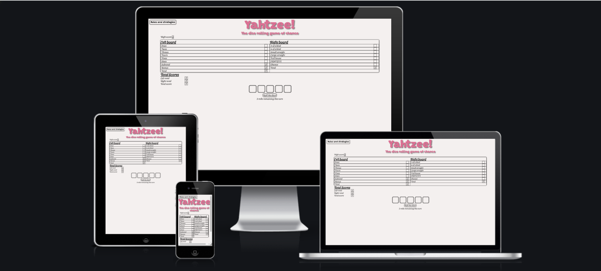
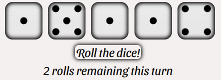
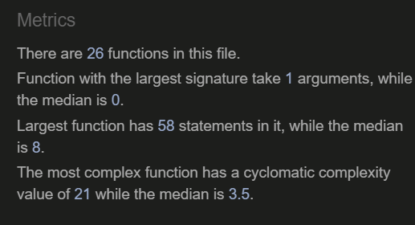

# Yahtzee

Yahtzee is a game where you have to roll 5 dice and fill in a score sheet to get the highest score possible. All 5 dice can be held at any point to get the best score possible for that round, and dice can be rolled up to 3 times per round, playing a total of 13 rounds per game

## User Stories

### First Time Visitors
- As a first time visitor, I would like to be able to recognise that this is a game.
- As a first time visitor, I would like to understand the rules of the game, so I know how to play.
- As a first time visitor, I would like to know what each scoring section means, so I understand what I would need to roll.
- As a first time visitor, I would like to know what each section scores, or can score, with the best possible dice rolls.

### Returning Visitors
- As a returning visitor, I would like to understand what strategies there are to maximize my score.
- As a returning visitor, I would like to have the ability to see what scores I can get for each valid move.

### Frequent Visitors
- As a frequent visitor, I would like to see my highest score for this session, so I can try and beat it.

### Author Targets

- As the author, I would like people to know when they load the page that this website is a game of yhatzee.
- As the author, I would like anyone visiting the page to understand the rules of the game.
- As the author, I would like to give visitors the best chance of getting the best score by showing them simple game strategies.
- As the author, I want people to see what scores they can get with each valid play, with the dice they have rolled.
- As the author, I would like to display all confirmed scores for each round so that visitors know what scores have been selected already.

## Features

### Heading

- Displays what the game is called
- Explains what the game is about

### Rules Button

- Displays the rules of the game

### Rules

- Explains in detail what the rules of the game are
- Shows examples of dice rolls to further explain what scores a user can get with the game

### High Score Display

- Updates the players high score after each game whenever they get a new, higher score.

### Gameboard

- Fully responsive, when a score is clicked on will update the score for that game to represent the current score for the player.
- Score updates will only work if the player doesn't have a score there already.
- Clickable score boxes change to a pointer when hovered over.

### Total Scores

- Updates as the game goes on to match the full game score.

### Dice Section

- Fully responsive, pointer cursor visible when hovered over the dice and button.
- Random dice numbers shown when Roll the dice button is clicked.
- Visible change will be made when a dice is clicked on, to display which is being held.

## Testing

- I have tested the website on the following browsers: Google Chrome, Safari (mobile version).
- I can confirm the website is fully responsive to all screen sizes on the browsers stated.

### Bugs 
#### Fixed Bugs

- Scores box
    - Scores boxes had unexpectedly changed size so the boxes were almost invisible
        - I noticed I had accidentally changed the height in the score class to 10leftpx when changing the board names 
        - The bug was fixed by removing the word "left".
    - Bonus scores box wasn't working properly with design responsiveness.
        - When I was testing screen sizes, the score for the bonus points would drop to the left board total score, moving the box for the total score to the left.
        - The bonus box previously had an explanation of how to get the bonus. This has been moved to the bottom of the gameboard, and is linked appropriately, which has fixed the bug.
    - Score for the sixes wasn't updating with the click
        - When Testing, I noticed that whenever I clicked on the sixes box, the score wouldn't update
        - I hadn't added the sixes score function to the new round function, so when the sixes box was selected, the sixes score function was never getting called. 
    - Four of a kind and full house weren't displaying truthfully if any dice was held beforehand
        - When testing, I noticed using the potential scores function, that 4 of a kind wasn't displaying when I had held numbers, same with full house.
        - This was because, after the dices array was sorted, whenever the computer found a dice with the held class, it'd skip over it entirely, so if this dice number was in a different place in the array, it wouldn't actually update.
        - I fixed this by checking the class name of the dice being held, and then setting the dice value in that position to the number on the held dice.
    - Full house wasn't displaying when 3 of a kind was smaller numbers than pair.
        - When testing, I found that my full house was resulting in 0 in the full house scores section.
        - I found that I hadn't skipped to the next iteration in the for loop when I had found 3 of a kind, which therefore meant the loop would double check the same condition for the current dice being the same as the next dice, which would in turn break the loop.
    - Yahtzee was scoring 100 instead of 50 when there was a yahtzee for the user
        - I found that when a user would get a yahtzee, they'd get 100 points when they selected yahtzee, instead of 50.
        - I found that I set the gotYahtzee boolean to true before checking if the user had got a yahtzee already.
        - I fixed this bug by checking if the score the user had selected was yahtzee when checking if the user had already got yahtzee, so that there wasn't a double scoring in the yahtzee score

#### Unfixed bugs

- None

### Validation

- Using the [W3C Validator](https://validator.w3.org/nu/#textarea), I can confirm that index.html came back with no errors.

- Using the [Jigsaw Validator](https://jigsaw.w3.org/css-validator/validator), I can confirm that style.css came back with no errors.

- Using [JSHint](https://jshint.com/), I found that there were no issues with the code.

- I found that the page has excellent accessibility rating using lighthouse

### UX Testing

- These are the completed goals compared to the user stories I created at the beginning of the project

#### First Time Visitor

- Using the header of the page, I have made sure that anyone visiting the website for the first time will recognise that the website is a game
- I added a rules button in the top left hand corner of the website, so that any users can find out the rules of the game
- In the rules, I added 1 example of each of the scores so that players have an idea of what scores they can get
- In the rules section, I explained the different scores, and what scores users can get with each scores box

#### Returning Visitor

- In the future, I would like to add a strategies button that displays simple strategies to make the game easier to get higher scores
- For the returning visitors ease, I made sure to add a faded score, which represents the score the user can get with the current dice roll

#### Frequent Visitor

- I added a high score at the top left of the page so that someone can see their high score. In future, I would like to have the high score saved in a local file, so that the user can close the page, and then see their high score each time they open the website

#### Author Targets

- At the header of the page, I have put a h1 heading of Yahtzee! so that all users know the name of the game they're playing 
- At the top left of the page is a rules button, which displays the rules of the game for the user
- In the future, I would like to add a strategies button to give the user simple strategies they can use
- I added the potential score function to let the user understand what score they can get with their current roll
- When the user selects a score, the dice will reroll, the number of rolls left will be reset to 3 just before the reroll and will update whatever score they have selected to display the correct score for it

## Deployment

- The website was deployed via github, and the steps to do so are as follows:
    - Find the settings tab at the top of my github repository, and open
    - Along the left hand side of the settings page, find the pages tab under code and automation, and open
    - Click on the dropdown menu under source and select the main branch, then save
    - Once saved, the website will be published

The live link can be found here: [Yahtzee!](https://dylan097.github.io/yahtzee/)

## Credits

### Contents

- I found the bonus score specification and score on [Wikipedia](https://en.wikipedia.org/wiki/Yahtzee)
- I found information on how to code part of the small straight on [stack overflow](https://stackoverflow.com/questions/15671620/small-straight-method). Some of the other functions codes were inspired by this website as well.

### Media

- The dice images all came from [Yahoo!](https://uk.yahoo.com/) They were searched using the following links:
    - [Dice 1](https://uk.images.search.yahoo.com/search/images;_ylt=AwrNYqg8MFhi0nAAxoBNBQx.;_ylu=c2VjA3NlYXJjaARzbGsDYnV0dG9u;_ylc=X1MDMjExNDcxNzAwNQRfcgMyBGFjdG4DY2xrBGNzcmNwdmlkA1ZaSUtRREV3TGpJM3d1NHdZaFB3WUFPZU1tRXdNQUFBQUFBbUJQaUkEZnIDbWNhZmVlBGZyMgNzYS1ncARncHJpZANuS25vRnFqOFR1LmRESE5iblYxWnZBBG5fc3VnZwM5BG9yaWdpbgN1ay5pbWFnZXMuc2VhcmNoLnlhaG9vLmNvbQRwb3MDMARwcXN0cgMEcHFzdHJsAwRxc3RybAM4BHF1ZXJ5A2RpY2UlMjAxBHRfc3RtcAMxNjQ5OTQ2NzEy?p=dice+1&fr=mcafee&fr2=sb-top-uk.images.search&ei=UTF-8&x=wrt&type=E211GB885G0)
    - [Dice 2](https://uk.images.search.yahoo.com/search/images;_ylt=AwrNPC9XMFhikNkq6AVNBQx.;_ylu=c2VjA3NlYXJjaARzbGsDYnV0dG9u;_ylc=X1MDMjExNDcxNzAwNQRfcgMyBGFjdG4DY2xrBGNzcmNwdmlkAzhQR3NNekV3TGpJM3d1NHdZaFB3WUFBck1tRXdNQUFBQUFBbm5qQ0wEZnIDbWNhZmVlBGZyMgNzYS1ncARncHJpZANJcnhQdnhqYVFtT0lWN01rN2Uxa21BBG5fc3VnZwM5BG9yaWdpbgN1ay5pbWFnZXMuc2VhcmNoLnlhaG9vLmNvbQRwb3MDMARwcXN0cgMEcHFzdHJsAwRxc3RybAM4BHF1ZXJ5A2RpY2UlMjAyBHRfc3RtcAMxNjQ5OTQ2NzU0?p=dice+2&fr=mcafee&fr2=sb-top-uk.images.search&ei=UTF-8&x=wrt&type=E211GB885G0)
    - [Dice 3](https://uk.images.search.yahoo.com/search/images;_ylt=AwrNPC.BMFhiocAq82hNBQx.;_ylu=c2VjA3NlYXJjaARzbGsDYnV0dG9u;_ylc=X1MDMjExNDcxNzAwNQRfcgMyBGFjdG4DY2xrBGNzcmNwdmlkA1Q5a2NUVEV3TGpJM3d1NHdZaFB3WUFMTE1tRXdNQUFBQUFBcUtTbEoEZnIDbWNhZmVlBGZyMgNzYS1ncARncHJpZANhc1RIbnhZclFycTI5RlNPYURqQ25BBG5fc3VnZwM4BG9yaWdpbgN1ay5pbWFnZXMuc2VhcmNoLnlhaG9vLmNvbQRwb3MDMARwcXN0cgMEcHFzdHJsAwRxc3RybAM4BHF1ZXJ5A2RpY2UlMjAzBHRfc3RtcAMxNjQ5OTQ2Nzg0?p=dice+3&fr=mcafee&fr2=sb-top-uk.images.search&ei=UTF-8&x=wrt&type=E211GB885G0)
    - [Dice 4](https://uk.images.search.yahoo.com/search/images;_ylt=AwrNYqieMFhiP2IAJcpNBQx.;_ylu=c2VjA3NlYXJjaARzbGsDYnV0dG9u;_ylc=X1MDMjExNDcxNzAwNQRfcgMyBGFjdG4DY2xrBGNzcmNwdmlkA1dvSnVoREV3TGpJM3d1NHdZaFB3WUFXSU1tRXdNQUFBQUFBcjVaWnUEZnIDbWNhZmVlBGZyMgNzYS1ncARncHJpZANfNHhrMDNmdFRIU2JTVWZta2o1RFJBBG5fc3VnZwM1BG9yaWdpbgN1ay5pbWFnZXMuc2VhcmNoLnlhaG9vLmNvbQRwb3MDMARwcXN0cgMEcHFzdHJsAwRxc3RybAM4BHF1ZXJ5A2RpY2UlMjA0BHRfc3RtcAMxNjQ5OTQ2ODA4?p=dice+4&fr=mcafee&fr2=sb-top-uk.images.search&ei=UTF-8&x=wrt&type=E211GB885G0)
    - [Dice 5](https://uk.images.search.yahoo.com/search/images;_ylt=AwrFG1y3MFhio38rowBNBQx.;_ylu=c2VjA3NlYXJjaARzbGsDYnV0dG9u;_ylc=X1MDMjExNDcxNzAwNQRfcgMyBGFjdG4DY2xrBGNzcmNwdmlkA21FSnhiVEV3TGpJM3d1NHdZaFB3WUFBS01tRXdNQUFBQUFBdFl1cHIEZnIDbWNhZmVlBGZyMgNzYS1ncARncHJpZAN2QXVMZ3lxTFJxbWJpX2dXTWx6TmFBBG5fc3VnZwM3BG9yaWdpbgN1ay5pbWFnZXMuc2VhcmNoLnlhaG9vLmNvbQRwb3MDMARwcXN0cgMEcHFzdHJsAwRxc3RybAM4BHF1ZXJ5A2RpY2UlMjA1BHRfc3RtcAMxNjQ5OTQ2ODQx?p=dice+5&fr=mcafee&fr2=sb-top-uk.images.search&ei=UTF-8&x=wrt&type=E211GB885G0)
    - [Dice 6](https://uk.images.search.yahoo.com/search/images;_ylt=AwrFG1zYMFhiJ_AqvxpNBQx.;_ylu=c2VjA3NlYXJjaARzbGsDYnV0dG9u;_ylc=X1MDMjExNDcxNzAwNQRfcgMyBGFjdG4DY2xrBGNzcmNwdmlkAy5CdVFlakV3TGpJM3d1NHdZaFB3WUE4RE1tRXdNQUFBQUFBdlY1LmkEZnIDbWNhZmVlBGZyMgNzYS1ncARncHJpZANVQW5HZjJlbVRGdXE4dTlVd240WjJBBG5fc3VnZwMxMARvcmlnaW4DdWsuaW1hZ2VzLnNlYXJjaC55YWhvby5jb20EcG9zAzAEcHFzdHIDBHBxc3RybAMEcXN0cmwDOARxdWVyeQNkaWNlJTIwNgR0X3N0bXADMTY0OTk0Njg3NA--?p=dice+6&fr=mcafee&fr2=sb-top-uk.images.search&ei=UTF-8&x=wrt&type=E211GB885G0)